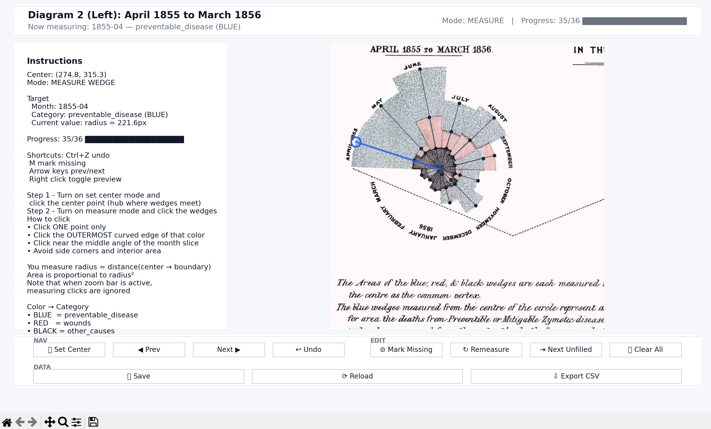
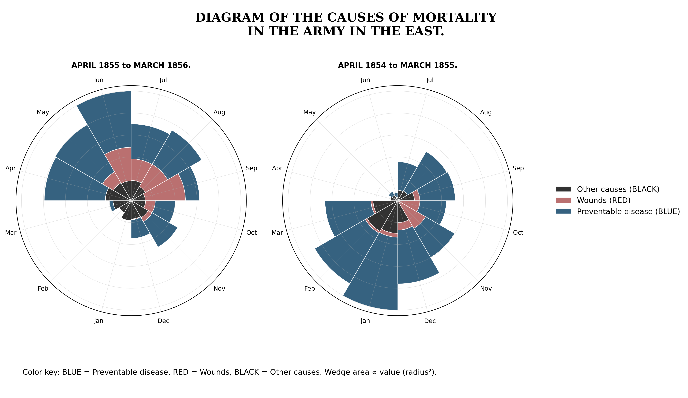

<p align="center">
  
</p>

<h1 align="center">
Florence Nightingale’s Rose Diagram — Data Reconstruction & Replication
</h1>


## Project Overview & Story


This project reconstructs Florence Nightingale’s famous *coxcomb* (polar area) diagrams using modern data digitization and visualization techniques.

During the Crimean War (1853–1856), Nightingale demonstrated that most British military deaths were caused not by combat wounds but by preventable diseases due to poor sanitation. Her visual argument directly influenced hospital reform and established data visualization as a powerful tool for policy change.

This project:

- Digitizes the original historical diagram
- Reconstructs proportional wedge areas
- Recreates the polar chart using Python


## The Original Diagram


<p align="center">
  
</p>


## Data Digitization Workflow

Because the original dataset does not provide raw mortality counts in modern format, we reconstruct relative values by measuring wedge areas directly from the diagram.

### Step 1 — How Data is collected



A custom Matplotlib-based digitizer was built to:

- Set the center of the polar diagram
- Click the outer boundary of each wedge
- Record radii for:
  - Preventable disease (blue)
  - Wounds (red)
  - Other causes (black)
- Save progress automatically (JSON)
- Export normalized area data to CSV

This allows precise and reproducible data extraction.


### Step 2 — Area Calculation

In Nightingale’s rose diagram, each month has the same angle, so the wedge area depends only on the radius. The area of a circular sector is proportional to r^2, so when you click the outer edge and compute:

```python
area_rel = radius_px ** 2
```

you are correctly capturing the value represented by that wedge.

When stacking categories, you must add areas, not radii:

```python
cum_area = area_table.cumsum(axis=1)
r_cum = np.sqrt(cum_area)
```

This works because wedge area ∝ r^2, so values add in area space, and you convert back to radius using the square root for plotting.


## Digitize Diagram

<p align="center">
  
</p>

## Key Insights

* The right diagram (April 1854–March 1855) shows that deaths from preventable diseases overwhelmingly exceeded deaths from wounds or other causes, especially during the winter months.
* The left diagram (April 1855–March 1856) shows a dramatic reduction in deaths from preventable diseases following sanitary reforms, while deaths from wounds remain comparatively smaller.
* This visualization demonstrates how clear statistical evidence can support data-driven policy change, showing that improved sanitation significantly reduced mortality.
* The contrast of before and after make it convincing that sanitation is indeed a significant factor in mortality counts. There might be limitation for polar chart too. Firstly, it would be hard to show to overall trend of the data. Secondly, for 2 similar counts, it would be hard to tell the difference because human is not sensitive to area. The limitations would be compensate by some alternative visualization ways.

## Technical Details

### File Structure

```
nightingale-rose/
├── README.md  
├── requirements.txt
├── data/
│   ├── data/progress_left.json
|   ├── data/progress_right.json
|   ├── output_data_left.csv
│   └── output_data_left.csv
├── src/
│   ├── app.py  
│   └── plot-rose.py
├── output/
│   └── nightingale_rose.png
└── assets/
    ├── nightingale_original.png  
    └── logo.png
```

### Core Library
- `matplotlib` - Interactive plotting and UI components
- `PIL` (Pillow) - Image loading and manipulation
- `tkinter` - Dialog boxes (messagebox)
- **Standard library**: json, math, os, dataclasses, typing, argparse

plot-rose.py (Visualization):
- `numpy` - Numerical computations
- `pandas` - Data manipulation and CSV handling
- `matplotlib` - Rose diagram visualization
- **Standard library**: os, calendar


## How to Run


1. Clone the repository

```
git clone git@github.com:YiyangGes/nightingale-rose-digitizer.git`
cd nightingale-rose-digitizer
```

2. Install dependencies

```
pip install -r requirements.txt
```

3. Run the digitizer in terminal to collect the data through interactive measurement (optional since there is data ready)

    For the diagram on left:

    ```
    python app.py --image assets/your_combined_image.jpg --diagram left
    ```

    For the diagram on the right

    ```
    python app.py --image assets/your_combined_image.jpg --diagram right
    ```
4. Plot with data collected

```
python plot-rose.py
```

## What I have learned
Throughout this project, I learned the importance of planning carefully before implementation in order to work efficiently and avoid unnecessary rework. Structuring the workflow—from digitization to data processing to visualization—significantly improved both clarity and productivity.

I also strengthened my ability to collaborate with AI tools by writing concise and precise prompts. Clear, well-structured instructions led to more accurate outputs and smoother iteration, reinforcing the value of intentional communication in human–AI collaboration.

## Reference
https://www.historyofinformation.com/detail.php?entryid=3815
